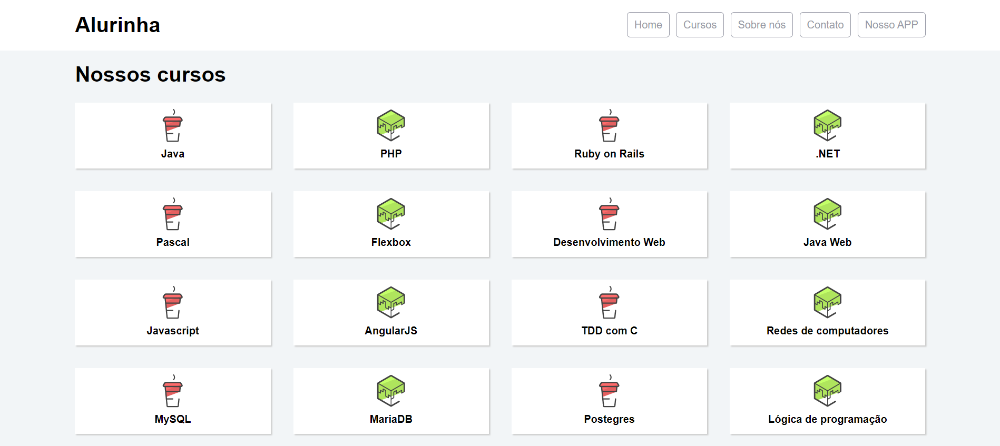

<h1 align="center">
  
</h1>

<h3 align="center">
  Flexbox: Posicione elementos na tela
</h3>

Aprenda a famosa especificação flexible box para posicionar seus elementos na página e entenda as diversas propriedades do flexbox e como usá-la

Por Yuri Padilha - Alura

  <a href="#como-executar-o-projeto">Como executar o projeto</a>&nbsp;&nbsp;&nbsp;|&nbsp;&nbsp;&nbsp;
  <a href="#conteúdo-do-curso">Conteúdo do curso</a>

 

Front-end

  

## Como executar o projeto

- Execute `git clone https://github.com/alura-flexbox-posicione-elementos-na-tela.git` para clonar este repositório
- Abra o arquivo index.html no seu navegador de preferência para ver o resultado

## Conteúdo do curso

- Introdução e Cabeçalho da página
- Fazendo o rodapé
- Fazendo o grid de cursos
- Adaptando para mobile
- Mais sobre flexbox & desafios
